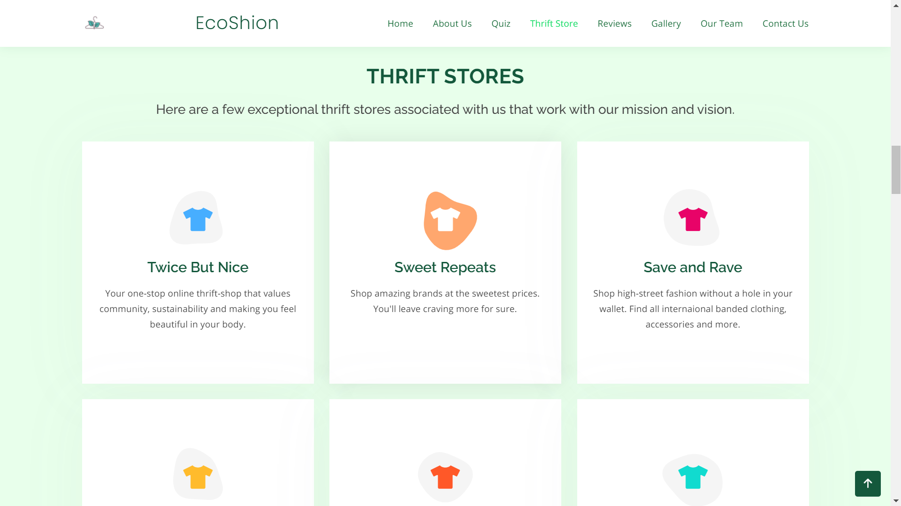

# EcoShion - Make your clothes match your values

> Fashion shouldn't cost the Earth

\
Ecoshion is an innovative platform bulit with a great mission to educate the populace about the dire effects of fast fashion by encouraging them to choose more sustainable forward brands.\
\
Since more than 50% of fast fashion clothes will be discarded within one year of purchase, the vision of the project is to enable people to make choices encompassing ethical and sustainably produced products. **Through this platform, we share sustainable methods and set forth the scope of thrift shops and alternatives to fast fashion**.\
\
\

---
# Tech Stack
1) HTML
2) CSS
3) Bootstrap
4) JavaScript

---

# Local Installation
* Drop a ⭐ on Github Repository.
* Clone the Repo by going to your local Git Client and pushing in the command: \
  `https/github/sonali-dudekula/EcoShion.git`
* Run the index.html file on your local server.
* Become a better consumer.

---

# Project Features
* An interface providing exposure for Thrift Stores.
* An included quiz form that gives user an insight on how to become a better consumer.

---

# Screenshots
\
\

---

# Project Links
* Project Website: https://ecoshion.netlify.app/
* Project Video: https://drive.google.com/file/d/1X8ypSDj853gVTvCaxZs0qYbgUL-iD20p/view?usp=drivesdk
* Project Citations: \
            - https://unsplash.com/ \
            - https://www.netlify.com/

---

# Team - 404 Found
* [SAI SONALI](https://github.com/sonali-dudekula)
* [ABHIGNA NADUPALLI](https://github.com/Abhigna-Nadupalli)
* [ANUSHA DOKKA](https://github.com/anushad-13)
